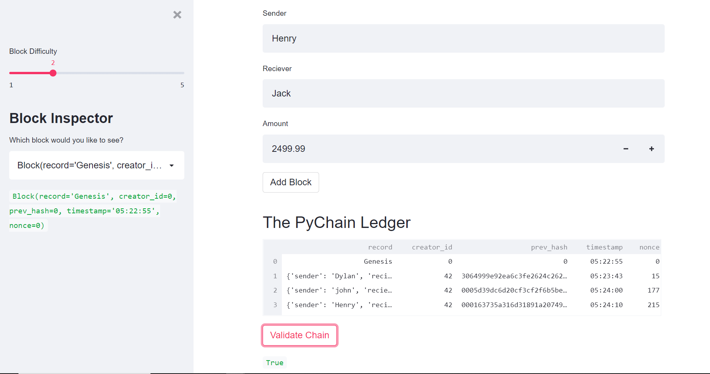

## module_18_challenge
# Pychain
The goal of this python file is to have a simple ledger of blockchains and using a dataframe to keep track of sender's and recievers.
-------------------------------------------------------------------------------------------------------------------------

# Technologies Used
We used VS Code, Blockchain, Pychain, Streamlit, dataclass, and hashlib.  
-------------------------------------------------------------------------------------------------------------------------

# Installation
We will need to install streamlit *can be pip install* and imports from hashlib.
-------------------------------------------------------------------------------------------------------------------------

# Example
We are creating an interactive site through streamlit. This site will allow us to input a sender id and reciever id as well as the amount for the transaction. This is the building block to creating a full site having transactions for crypto. after the inputs are completed we create a new block hash it so it is encrypted and ballons are added for success along with having the True for validated block.

-------------------------------------------------------------------------------------------------------------------------
